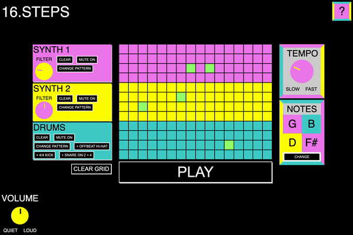

# 16.Steps


## Project Brief

My goal in this project was to create a digital instrument using the Web Audio API and a GUI that would allow the user to create and edit sequences and manipulate the sound.

## Technologies Used

* HTML5
* JavaScript (ES6)
* CSS3
* Web Audio API
* Git / GitHub

## Deployed Version

https://rickyc000.github.io/16.Steps/



## How To Use

To get started simply press play and click on any of the grid cells. Indicated by the cells illuminated in blue, the playhead moves across the grid triggering different notes or drum sounds at each step.

16.Steps features two synthesizer sounds, each routed through their own respective lowpass filter. The cutoff frequency of each filter can be adjusted using the knob on the left-hand side of the synth controls. 

Each instrument can be muted and includes a 'Clear' button, allowing the user to wipe the instrument's existing cell pattern from the grid. 

The user can also select the option to 'Change Pattern', wiping the existing grid arrangement and adding a randomly selected sequence from a set of pre-written patterns. For the Drums section, there are additional options available for adding rhythmic patterns to the grid.

Volume and Tempo knobs allow the user to adjust the output gain and BPM of the sequencer and a musical notes section displays the currently selected notes with the option to switch to a different set.

## Process

### Knobs

One of the more complex aspects of this project was producing the knobs that would allow the user to adjust various different parameters.

As the user interacts with the element, the transform-style property is updated with a rotate percentage value. 

Event listeners allow the user to engage the knob on mousedown and drag up or down, adjusting the parameter value between a defined range dependant on the distance from the `event.clientY` value when initially engaged:

```
  //* Create knob function
  function createKnob(min, max, parameter, knob) {
    knob.classList = 'knob'
    let knobPosition = 0
    knob.style = `--percentage:${knobPosition}`

    let knobEngaged = false
    let previousY = null
    let knobPercentage = ((knobPosition + 50) / 290) * 100
    const range = max - min
    let value = (knobPercentage / 100 * range) + min

    //* Engages when clicked
    function engageKnob(event) {
      knobEngaged = true
      previousY = event.clientY
      event.preventDefault()
    }
    function disengageKnob() {
      knobEngaged = false
    }

    function rotaryMove(Y) {
      if (knobEngaged) {
        if (previousY - Y === 0) {
          return
        }
        const isGoingUp = previousY >= Y
        previousY = Y

        //* If the knob is at the top/bottom, do nothing:
        if (knobPosition <= -145 && isGoingUp === false ||
          knobPosition >= 145 && isGoingUp === true) {
          return
        }

        //* Determines the rate of knob movement
        isGoingUp ? knobPosition = knobPosition + 5 : knobPosition = knobPosition - 5

        //* Sets the knob position
        knob.style = `--percentage:${knobPosition}`

        //* Turns the value into a percentage
        knobPercentage = ((knobPosition + 145) / 290) * 100

        //* Turn this value into a range between 80 / 200
        value = (knobPercentage / 100 * range) + min

        //* Updates depending on which parameter is set:
        if (parameter === 'tempo') {
          BPM = value   
        }
        if (parameter === 'bassFilter') {
          bassFilter.frequency.exponentialRampToValueAtTime(value, audioContext.currentTime + 0.2)
        }
        if (parameter === 'leadFilter') {
          leadFilter.frequency.value = value
        }
        if (parameter === 'mainVolume') {
          primaryGainControl.gain.value = value
        }
      }
    }

    knob.addEventListener('mousedown', engageKnob)
    window.addEventListener('mouseup', disengageKnob)
    window.addEventListener('mousemove', event => {
      rotaryMove(event.clientY)
    })
    return value - 50
  }
```

### Synthesis
All sounds are created using the Web Audio API. The code to create the kick drum shown below is a typical example of how each sound is produced.

The `exponentialRampToValueAtTime` method schedules a gradual exponential change in a specified value, in this case the note frequency, allowing us to accurately design the kick drum sonics:

```
  function playDrums(note) {

    if (drumsMuted === false) {

      if (note === 'kick') {
        const kickOscillator = audioContext.createOscillator()
        kickOscillator.frequency.exponentialRampToValueAtTime(
          0.2,
          audioContext.currentTime + 0.2
        )
        kickOscillator.type = 'sine'
        kickOscillator.connect(kickFilter)
        kickOscillator.start()
        kickOscillator.stop(audioContext.currentTime + 0.5)
      }
```

The kick drum oscillator is then connected to a lowpass filter which enables us to shape the sound before routing the audio to a gain node:

```
  const kickFilter = audioContext.createBiquadFilter()
  kickFilter.type = 'lowpass'
  kickFilter.frequency.value = 500
  kickFilter.connect(kickGainControl)
```

Using similar filtering techniques on a white noise audio source we're able to create the snare and hi-hat sounds, whilst the Synth 1 sound is produced by layering two different oscillators.

## Reflection
### Challenges

* **UI Design:** The interface was designed with the intention of creating an instrument that is simple, fun and easy to use. I thought carefully about which parameters the user should be able to adjust and used non-technical terms such as slow and fast, rather than Beats Per Minute (BPM) for example to achieve this.
### Key Learnings

* **Web Audio API:** In this project I've used only a handful of simple techniques relating to the Web Audio API. The system has proven to be a powerful and versatile way of handing audio and I look forward to exploring its possibilities in much more depth.